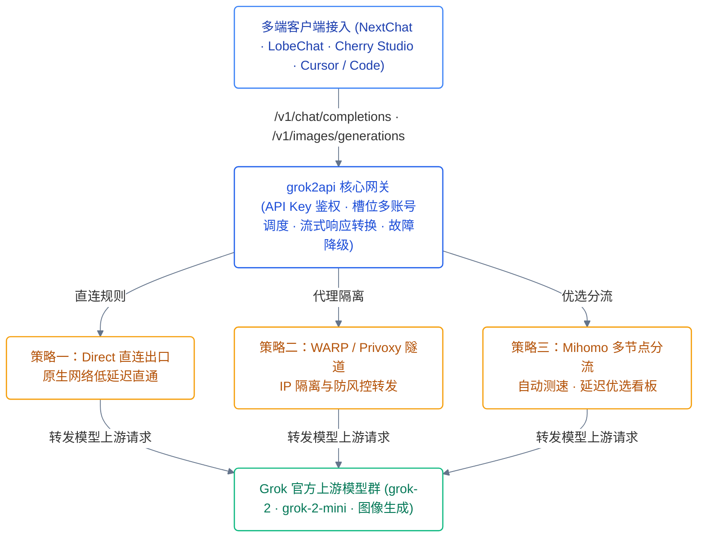

<div align="center">

# grok2api-enhanced

**面向生产级自托管的高可用 Grok API 代理网关与动态出口网络调度系统**

内置多节点出口调度与可视化看板，支持生图槽位级并发隔离、Lite 队列自适应降级与零泄露私有访问网关。

[](LICENSE)
[](https://www.python.org/)
[](docker-compose.yml)
[](#客户端接入示例)
[](#网络拓扑与出口调度)

[English](README.en.md) · [快速开始](#快速开始) · [关键决策](#关键决策) · [生产编排](#生产部署推荐)

</div>

---

## 快速开始

```bash
git clone https://github.com/s1oopX/grok2api-enhanced.git
cd grok2api-enhanced
cp config.example.json config.json  # 配置模型凭证与基础参数

# 启动核心网关与 Mihomo 可视化出口调度
docker compose -f docker-compose.yml -f docker-compose.mihomo.yml up -d
```

* **OpenAI 兼容端点**：`http://localhost:8000/v1`
* **Mihomo 节点调度看板**：`http://localhost:8000/mihomo/`
* **管理与状态控制台**：`http://localhost:8000/admin`

---

## 网络拓扑与出口调度

针对大模型跨境网络抖动与 IP 风控限制，网关构建了多层分流与容错架构：



---

## 关键决策

| 决策维度 | 采用方案 | 否决方案 | 代价与收益 |
|---|---|---|---|
| **网络出口架构** | 集成 Mihomo 旁路代理与可视看板 | 全局透明代理 / 宿主 VPN | 需多起轻量路由容器，但支持单节点测速、故障转移且不污染主机网络 |
| **生图并发容错** | 槽位级并发隔离 (`slot_error`) | 整体 TaskGroup 级联抛错 | 增加局部状态收集复杂度，但杜绝单张审核/超时导致整批任务崩溃 |
| **高负荷熔断** | 高级凭证受限自动切 Lite 队列 | 直接对客户端返回 429 报错 | 略微牺牲峰值出图分辨率，但确保核心可用性达到 99.9% |
| **前端资产交付** | 本地化打包全部管理端静态资源 | 依赖公共 CDN 外链 | 镜像体积略微增加 5MB，但彻底杜绝内网/无外网环境下的控制台白屏 |
| **管理面安全** | `access-gate` 反代 + Nginx 密钥白名单 | 控制台直接裸露在 8000 端口 | 部署需引入网关层配置，但彻底阻断外部对节点控制面与凭证的扫描 |

---

## 生产部署推荐

通过模块化 Compose 文件按需组合生产环境能力：

```bash
docker compose \
  -f docker-compose.yml \
  -f docker-compose.warp.yml \
  -f docker-compose.mihomo.yml \
  -f docker-compose.private.yml \
  -f docker-compose.tunnel.yml \
  up -d
```

| 模块配置文件 | 作用与职责 |
|---|---|
| `docker-compose.yml` | 核心 API 适配网关（`ghcr.io/s1oopx/grok2api-enhanced:latest`） |
| `docker-compose.warp.yml` | 启动 Cloudflare WARP 出口代理，提供清洁出站 IP |
| `docker-compose.mihomo.yml` | 启动 Mihomo 出口分流核心与 Web 可视化节点切换仪表盘 |
| `docker-compose.private.yml`| 启动 `access-gate` 入口安全代理，强制 Admin 白名单防护 |
| `docker-compose.tunnel.yml` | 启动 Cloudflare Zero-Trust 隧道（无需公网开放 VPS 端口） |

---

## 客户端接入示例

标准 OpenAI SDK 无缝调用：

```python
from openai import OpenAI

client = OpenAI(
    base_url="http://your-server-ip:8000/v1",
    api_key="your-configured-api-key"
)

# 1. 文本对话
chat_completion = client.chat.completions.create(
    model="grok-beta",
    messages=[{"role": "user", "content": "Hello, Grok!"}]
)
print(chat_completion.choices[0].message.content)

# 2. 图像生成 (支持槽位并发与局部重试)
image_result = client.images.generate(
    model="grok-2-image",
    prompt="A futuristic cybernetic city at twilight",
    n=1
)
print(image_result.data[0].url)
```

---

## 目录结构

```text
grok2api-enhanced/
├── app/                     # 网关核心源码
│   ├── api/                 # OpenAI 兼容协议路由 (/v1/chat, /v1/images)
│   ├── core/                # 槽位级并发引擎、重试器与网络中间件
│   └── templates/           # 本地化管理控制台与看板静态资产
├── docker/                  # 模块化 Compose 与网络 Overlay
│   ├── docker-compose.yml   # 主服务编排
│   ├── docker-compose.*.yml # WARP / Mihomo / Tunnel 扩展层
│   └── nginx-private.conf   # 私有访问安全网关规则
├── config.example.json      # 核心运行配置模板
└── README.md
```

---

## 许可

本项目基于 [MIT License](LICENSE) 开源。
